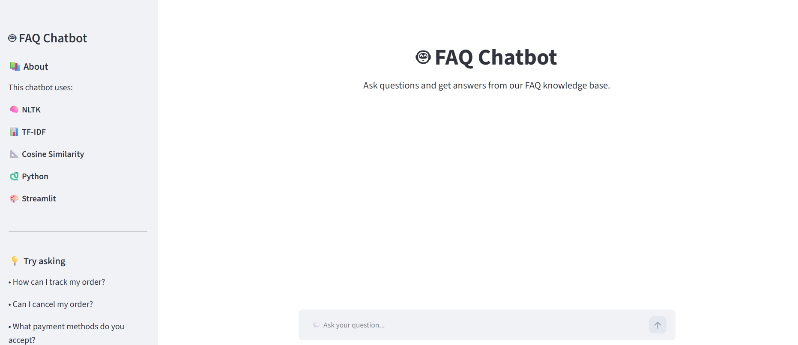
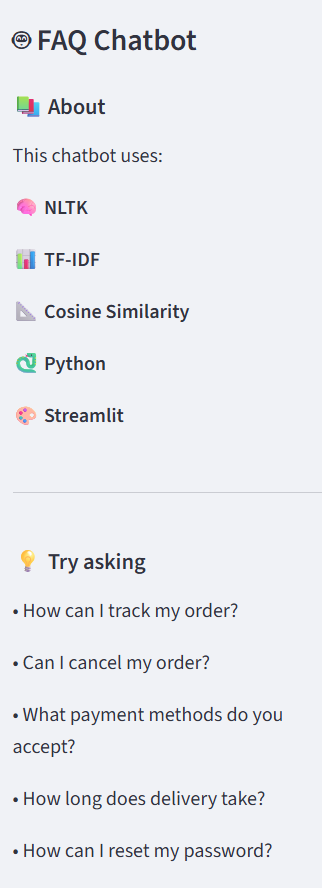
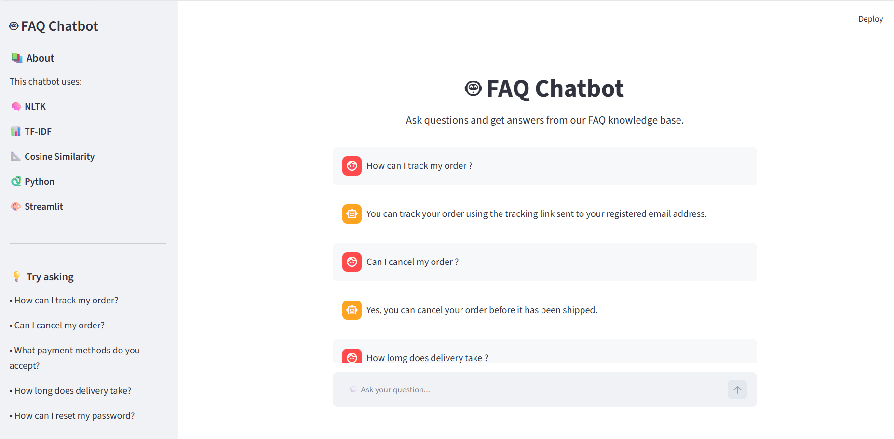

# 🤖 FAQ Chatbot Using NLTK

An NLP-based FAQ Chatbot built using Python, NLTK, TF-IDF, Cosine Similarity and Streamlit.

---

## 🏠 Home

The home page provides an interactive interface where users can ask questions related to the FAQ knowledge base.



---

## 📖 About

The About section provides information about the project, technologies used and the NLP approach.



---

## 💬 Output

The chatbot matches the user's question with the most relevant FAQ and provides an appropriate answer.



---

## 🧠 Technologies Used

- 🐍 Python
- 🧠 NLTK
- 📊 Pandas
- 📐 Scikit-learn
- 🎨 Streamlit
- 📄 CSV

---

## ⚙️ How It Works

```text
👤 User Question
       ↓
🧹 Text Preprocessing
       ↓
🔤 Tokenization
       ↓
🚫 Stopword Removal
       ↓
📝 Lemmatization
       ↓
📊 TF-IDF Vectorization
       ↓
📐 Cosine Similarity
       ↓
🎯 Best FAQ Match
       ↓
🤖 Answer
